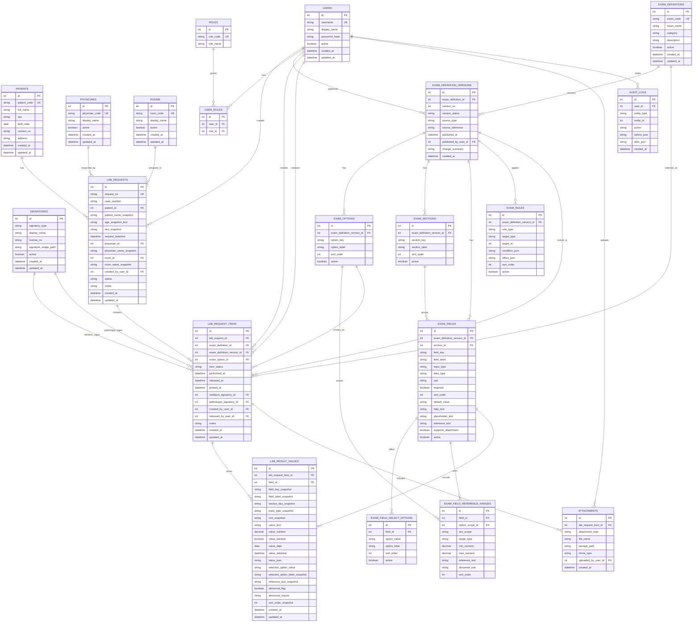

# System ERD

This ERD follows the approved direction:
- workbook-first
- fixed clinic core
- configurable exam schema
- versioned exam definitions
- row-based result storage

## ERD

## Read This In 3 Layers

### 1. Clinic core
These are the stable operational entities:
- `PATIENTS`
- `PHYSICIANS`
- `ROOMS`
- `SIGNATORIES`
- `USERS`
- `ROLES`
- `USER_ROLES`
- `LAB_REQUESTS`

This layer should remain mostly fixed even if exams change.

### 2. Configurable exam engine
These define what an exam looks like:
- `EXAM_DEFINITIONS`
- `EXAM_DEFINITION_VERSIONS`
- `EXAM_OPTIONS`
- `EXAM_SECTIONS`
- `EXAM_FIELDS`
- `EXAM_FIELD_SELECT_OPTIONS`
- `EXAM_FIELD_REFERENCE_RANGES`
- `EXAM_RULES`

This is where the workbook-driven flexibility lives.

### 3. Saved clinical results
These store the actual encoded result records:
- `LAB_REQUEST_ITEMS`
- `LAB_RESULT_VALUES`
- `ATTACHMENTS`
- `AUDIT_LOGS`

This layer must be historically stable.

## Relationship Notes

### `LAB_REQUESTS` -> `LAB_REQUEST_ITEMS`
One request can contain multiple exam items.

Examples:
- one request with `URINALYSIS`
- one request with `URINALYSIS` plus `PREGNANCY TEST`
- one request with `CBC` plus `HBA1C`

### `EXAM_DEFINITIONS` -> `EXAM_DEFINITION_VERSIONS`
An exam family can have many versions.

Example:
- `OGTT` version 1
- `OGTT` version 2 after admin changes fields/ranges

### `EXAM_DEFINITION_VERSIONS` -> `EXAM_OPTIONS`
A version can expose multiple requestable options/packages.

Examples:
- `50g OGTT`
- `75g OGTT`
- `100g OGTT`

### `EXAM_DEFINITION_VERSIONS` -> `EXAM_SECTIONS`
A version can define logical groups used in UI and future printing.

Examples:
- `MACROSCOPIC FINDING`
- `PRO TIME`
- `APTT`

### `EXAM_DEFINITION_VERSIONS` -> `EXAM_FIELDS`
Each published version owns its exact field list.

This is how we avoid changing database tables whenever a field changes.

### `EXAM_FIELDS` -> `EXAM_FIELD_SELECT_OPTIONS`
Only select/dropdown fields will use child options.

### `EXAM_FIELDS` -> `EXAM_FIELD_REFERENCE_RANGES`
Ranges are stored separately because:
- not all fields have ranges
- some fields have sex-specific ranges
- some fields have option/package-specific ranges

### `LAB_REQUEST_ITEMS` -> `EXAM_DEFINITION_VERSIONS`
This relationship is one of the most important in the system.

Each saved exam item must point to the exact published version that was active when the result was encoded.

That prevents old results from breaking when the admin changes a future version.

### `LAB_RESULT_VALUES` -> `EXAM_FIELDS`
A saved result row points to the field definition it came from, but also stores snapshots such as:
- field key
- field label
- unit
- reference text

This adds historical safety.

## Why `field_key` Matters
The workbook has repeated visible labels such as:
- `IgM`
- `IgG`
- `1ST HOUR`
- `2ND HOUR`
- `TEST`
- `CONTROL`

So visible labels are not reliable identifiers.

Examples of correct internal keys:
- `typhidot_igm`
- `dengue_igm`
- `ogtt_50g_1st_hour`
- `aptt_test`
- `protime_test`

## Why `EXAM_DEFINITION_VERSIONS` Matters
Without versioning:
- old results can become unreadable
- labels can change retroactively
- reference ranges can shift unexpectedly
- audit history becomes weak

With versioning:
- published exam schemas become immutable
- new edits create a new version
- historical requests remain tied to the exact old schema

## Optional Simplification For MVP
If you want a simpler v1, these can be deferred:
- `ROLES` / `USER_ROLES` if using very basic user roles first
- `EXAM_RULES` if you hardcode minimal visibility rules temporarily
- advanced attachment types

But these should stay in the long-term ERD because the workbook suggests they will be needed.

## Recommended Next Step
After you approve this ERD, the best next move is:
- convert this into Django models

Suggested Django app split:
- `core`
- `exams`
- `results`
- `accounts`
